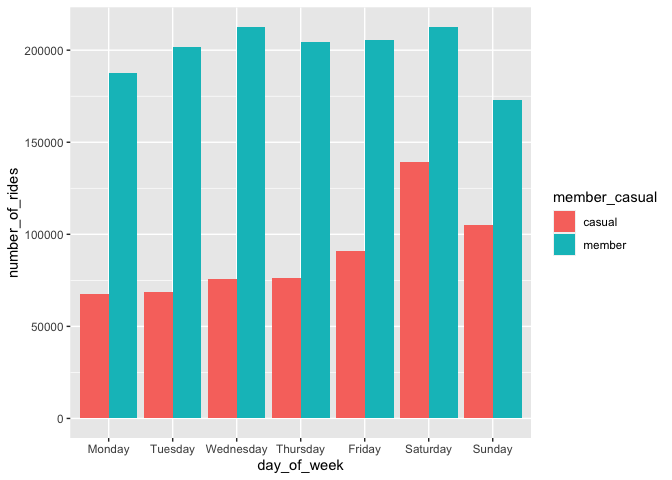
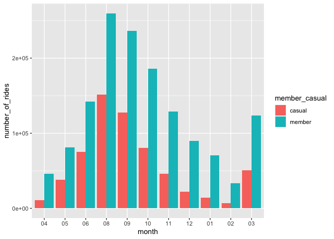
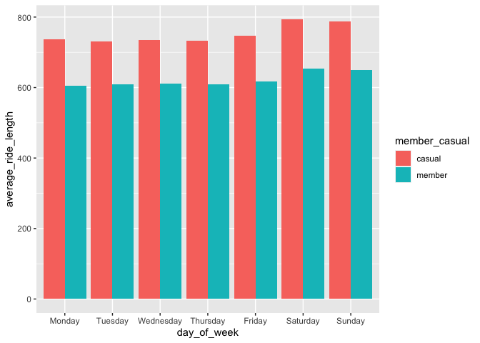
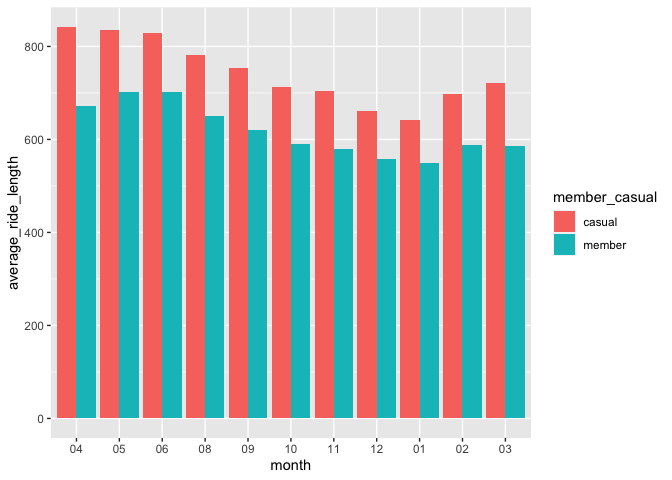
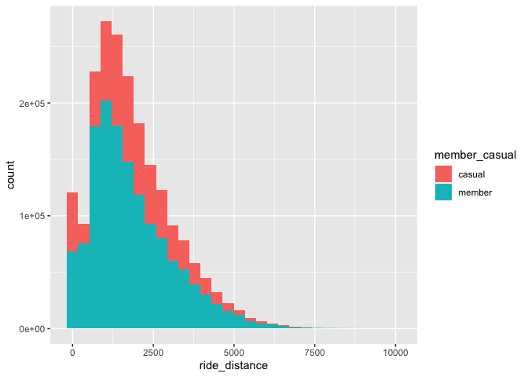

Case Study: How Does a Bike-Share Navigate Speedy Success?
================
Rachel Kwon
4/18/2023

# Scenario

I am a junior data analyst working in the marketing analyst team at
Cyclistic, a bike-share company in Chicago. The director of marketing
believes the company’s future success depends on maximizing the number
of annual memberships. Therefore, my team wants to understand how casual
riders and annual members use Cyclistic bikes differently. From these
insights, my team will design a new marketing strategy to convert casual
riders into annual members. But first, Cyclistic executives must approve
my recommendations, so they must be backed up with compelling data
insights and professional data visualizations.

## About the company

In 2016, Cyclistic launched a successful bike-share offering. Since
then, the program has grown to a fleet of 5,824 bicycles that are
geotracked and locked into a network of 692 stations across Chicago. The
bikes can be unlocked from one station and returned to any other station
in the system anytime. Until now, Cyclistic’s marketing strategy relied
on building general awareness and appealing to broad consumer segments.
One approach that helped make these things possible was the flexibility
of its pricing plans: single-ride passes, full-day passes, and annual
memberships. Customers who purchase single-ride or full-day passes are
referred to as casual riders. Customers who purchase annual memberships
are Cyclistic members. Cyclistic’s finance analysts have concluded that
annual members are much more profitable than casual riders. Although the
pricing flexibility helps Cyclistic attract more customers, Moreno
believes that maximizing the number of annual members will be key to
future growth. Rather than creating a marketing campaign that targets
all-new customers, Moreno believes there is a very good chance to
convert casual riders into members. She notes that casual riders are
already aware of the Cyclistic program and have chosen Cyclistic for
their mobility needs. Moreno has set a clear goal: Design marketing
strategies aimed at converting casual riders into annual members. In
order to do that, however, the marketing analyst team needs to better
understand how annual members and casual riders differ, why casual
riders would buy a membership, and how digital media could affect their
marketing tactics. Moreno and her team are interested in analyzing the
Cyclistic historical bike trip data to identify trends.

## Goals

Three questions will guide the future marketing program:

1.  How do annual members and casual riders use Cyclistic bikes
    differently?

2.  Why would casual riders buy Cyclistic annual memberships?

3.  How can Cyclistic use digital media to influence casual riders to
    become members?

Moreno has assigned me the first question to answer:

How do annual members and casual riders use Cyclistic bikes differently?

I will produce a report with the following deliverables:

1.  A clear statement of the business task

2.  A description of all data sources used

3.  Documentation of any cleaning or manipulation of data

4.  A summary of your analysis

5.  Supporting visualizations and key findings

6.  Your top three recommendations based on your analysis

## Ask

**Business Task:** I will find trends within the data set in order to
find solutions to optimize customer use. Patterns in the data will
highlight motivations for a membership. Using this data, I will deliver
insights on potential areas for growth.

## Prepare

About the data set: I used Divvy’s, a bike-share program based in
Chicago, data from April 2020- March 2021 to complete this case study.
To download the data, please use this
[link](http://divvy-tripdata.s3.amazonaws.com/index.html). This data was
made public by Motivate International Inc, under this license. Due to
data privacy issues, personal information has been removed or encrypted.

### Importing data and packages

``` r
library(tidyverse)  
```

    ## ── Attaching core tidyverse packages ──────────────────────── tidyverse 2.0.0 ──
    ## ✔ dplyr     1.1.1     ✔ readr     2.1.4
    ## ✔ forcats   1.0.0     ✔ stringr   1.5.0
    ## ✔ ggplot2   3.4.2     ✔ tibble    3.2.1
    ## ✔ lubridate 1.9.2     ✔ tidyr     1.3.0
    ## ✔ purrr     1.0.1     
    ## ── Conflicts ────────────────────────────────────────── tidyverse_conflicts() ──
    ## ✖ dplyr::filter() masks stats::filter()
    ## ✖ dplyr::lag()    masks stats::lag()
    ## ℹ Use the conflicted package (<http://conflicted.r-lib.org/>) to force all conflicts to become errors

``` r
library(lubridate) 
library(ggplot2)  
library(dplyr) 
library(tidyr) 
library(geosphere)
```

### Renaming datasets

``` r
tripdata_2020_04 <-read.csv("~/Downloads/202004-divvy-tripdata (1).csv")
tripdata_2020_05 <-read.csv("~/Desktop/bikeshare /202005-divvy-tripdata.csv")
tripdata_2020_06 <-read.csv("~/Desktop/bikeshare /202006-divvy-tripdata.csv")
tripdata_2020_07 <-read.csv("~/Desktop/bikeshare /202008-divvy-tripdata.csv")
tripdata_2020_08 <-read.csv("~/Desktop/bikeshare /202008-divvy-tripdata.csv")
tripdata_2020_09 <-read.csv("~/Desktop/bikeshare /202009-divvy-tripdata.csv")
tripdata_2020_10 <-read.csv("~/Desktop/bikeshare /202010-divvy-tripdata.csv")
tripdata_2020_11 <-read.csv("~/Desktop/bikeshare /202011-divvy-tripdata.csv")
tripdata_2020_12 <-read.csv("~/Desktop/bikeshare /202012-divvy-tripdata.csv")
tripdata_2021_01 <-read.csv("~/Desktop/bikeshare /202101-divvy-tripdata.csv")
tripdata_2021_02 <-read.csv("~/Desktop/bikeshare /202102-divvy-tripdata.csv")
tripdata_2021_03 <-read.csv("~/Desktop/bikeshare /202103-divvy-tripdata.csv")
```

## Reviewing Dataset

### Checking Columns

``` r
colnames(tripdata_2020_04)
```

    ##  [1] "ride_id"            "rideable_type"      "started_at"        
    ##  [4] "ended_at"           "start_station_name" "start_station_id"  
    ##  [7] "end_station_name"   "end_station_id"     "start_lat"         
    ## [10] "start_lng"          "end_lat"            "end_lng"           
    ## [13] "member_casual"

``` r
colnames(tripdata_2020_05)
```

    ##  [1] "ride_id"            "rideable_type"      "started_at"        
    ##  [4] "ended_at"           "start_station_name" "start_station_id"  
    ##  [7] "end_station_name"   "end_station_id"     "start_lat"         
    ## [10] "start_lng"          "end_lat"            "end_lng"           
    ## [13] "member_casual"

``` r
colnames(tripdata_2020_06)
```

    ##  [1] "ride_id"            "rideable_type"      "started_at"        
    ##  [4] "ended_at"           "start_station_name" "start_station_id"  
    ##  [7] "end_station_name"   "end_station_id"     "start_lat"         
    ## [10] "start_lng"          "end_lat"            "end_lng"           
    ## [13] "member_casual"

``` r
colnames(tripdata_2020_07)
```

    ##  [1] "ride_id"            "rideable_type"      "started_at"        
    ##  [4] "ended_at"           "start_station_name" "start_station_id"  
    ##  [7] "end_station_name"   "end_station_id"     "start_lat"         
    ## [10] "start_lng"          "end_lat"            "end_lng"           
    ## [13] "member_casual"

``` r
colnames(tripdata_2020_08)
```

    ##  [1] "ride_id"            "rideable_type"      "started_at"        
    ##  [4] "ended_at"           "start_station_name" "start_station_id"  
    ##  [7] "end_station_name"   "end_station_id"     "start_lat"         
    ## [10] "start_lng"          "end_lat"            "end_lng"           
    ## [13] "member_casual"

``` r
colnames(tripdata_2020_09)
```

    ##  [1] "ride_id"            "rideable_type"      "started_at"        
    ##  [4] "ended_at"           "start_station_name" "start_station_id"  
    ##  [7] "end_station_name"   "end_station_id"     "start_lat"         
    ## [10] "start_lng"          "end_lat"            "end_lng"           
    ## [13] "member_casual"

``` r
colnames(tripdata_2020_10)
```

    ##  [1] "ride_id"            "rideable_type"      "started_at"        
    ##  [4] "ended_at"           "start_station_name" "start_station_id"  
    ##  [7] "end_station_name"   "end_station_id"     "start_lat"         
    ## [10] "start_lng"          "end_lat"            "end_lng"           
    ## [13] "member_casual"

``` r
colnames(tripdata_2020_11)
```

    ##  [1] "ride_id"            "rideable_type"      "started_at"        
    ##  [4] "ended_at"           "start_station_name" "start_station_id"  
    ##  [7] "end_station_name"   "end_station_id"     "start_lat"         
    ## [10] "start_lng"          "end_lat"            "end_lng"           
    ## [13] "member_casual"

``` r
colnames(tripdata_2020_12)
```

    ##  [1] "ride_id"            "rideable_type"      "started_at"        
    ##  [4] "ended_at"           "start_station_name" "start_station_id"  
    ##  [7] "end_station_name"   "end_station_id"     "start_lat"         
    ## [10] "start_lng"          "end_lat"            "end_lng"           
    ## [13] "member_casual"

``` r
colnames(tripdata_2021_01)
```

    ##  [1] "ride_id"            "rideable_type"      "started_at"        
    ##  [4] "ended_at"           "start_station_name" "start_station_id"  
    ##  [7] "end_station_name"   "end_station_id"     "start_lat"         
    ## [10] "start_lng"          "end_lat"            "end_lng"           
    ## [13] "member_casual"

``` r
colnames(tripdata_2021_02)
```

    ##  [1] "ride_id"            "rideable_type"      "started_at"        
    ##  [4] "ended_at"           "start_station_name" "start_station_id"  
    ##  [7] "end_station_name"   "end_station_id"     "start_lat"         
    ## [10] "start_lng"          "end_lat"            "end_lng"           
    ## [13] "member_casual"

``` r
colnames(tripdata_2021_03)
```

    ##  [1] "ride_id"            "rideable_type"      "started_at"        
    ##  [4] "ended_at"           "start_station_name" "start_station_id"  
    ##  [7] "end_station_name"   "end_station_id"     "start_lat"         
    ## [10] "start_lng"          "end_lat"            "end_lng"           
    ## [13] "member_casual"

### Checking data type

``` r
str(tripdata_2020_04)
```

    ## 'data.frame':    84776 obs. of  13 variables:
    ##  $ ride_id           : chr  "A847FADBBC638E45" "5405B80E996FF60D" "5DD24A79A4E006F4" "2A59BBDF5CDBA725" ...
    ##  $ rideable_type     : chr  "docked_bike" "docked_bike" "docked_bike" "docked_bike" ...
    ##  $ started_at        : chr  "2020-04-26 17:45:14" "2020-04-17 17:08:54" "2020-04-01 17:54:13" "2020-04-07 12:50:19" ...
    ##  $ ended_at          : chr  "2020-04-26 18:12:03" "2020-04-17 17:17:03" "2020-04-01 18:08:36" "2020-04-07 13:02:31" ...
    ##  $ start_station_name: chr  "Eckhart Park" "Drake Ave & Fullerton Ave" "McClurg Ct & Erie St" "California Ave & Division St" ...
    ##  $ start_station_id  : int  86 503 142 216 125 173 35 434 627 377 ...
    ##  $ end_station_name  : chr  "Lincoln Ave & Diversey Pkwy" "Kosciuszko Park" "Indiana Ave & Roosevelt Rd" "Wood St & Augusta Blvd" ...
    ##  $ end_station_id    : int  152 499 255 657 323 35 635 382 359 508 ...
    ##  $ start_lat         : num  41.9 41.9 41.9 41.9 41.9 ...
    ##  $ start_lng         : num  -87.7 -87.7 -87.6 -87.7 -87.6 ...
    ##  $ end_lat           : num  41.9 41.9 41.9 41.9 42 ...
    ##  $ end_lng           : num  -87.7 -87.7 -87.6 -87.7 -87.7 ...
    ##  $ member_casual     : chr  "member" "member" "member" "member" ...

``` r
str(tripdata_2020_05)
```

    ## 'data.frame':    200274 obs. of  13 variables:
    ##  $ ride_id           : chr  "02668AD35674B983" "7A50CCAF1EDDB28F" "2FFCDFDB91FE9A52" "58991CF1DB75BA84" ...
    ##  $ rideable_type     : chr  "docked_bike" "docked_bike" "docked_bike" "docked_bike" ...
    ##  $ started_at        : chr  "2020-05-27 10:03:52" "2020-05-25 10:47:11" "2020-05-02 14:11:03" "2020-05-02 16:25:36" ...
    ##  $ ended_at          : chr  "2020-05-27 10:16:49" "2020-05-25 11:05:40" "2020-05-02 15:48:21" "2020-05-02 16:39:28" ...
    ##  $ start_station_name: chr  "Franklin St & Jackson Blvd" "Clark St & Wrightwood Ave" "Kedzie Ave & Milwaukee Ave" "Clarendon Ave & Leland Ave" ...
    ##  $ start_station_id  : int  36 340 260 251 261 206 261 180 331 219 ...
    ##  $ end_station_name  : chr  "Wabash Ave & Grand Ave" "Clark St & Leland Ave" "Kedzie Ave & Milwaukee Ave" "Lake Shore Dr & Wellington Ave" ...
    ##  $ end_station_id    : int  199 326 260 157 206 22 261 180 300 305 ...
    ##  $ start_lat         : num  41.9 41.9 41.9 42 41.9 ...
    ##  $ start_lng         : num  -87.6 -87.6 -87.7 -87.7 -87.7 ...
    ##  $ end_lat           : num  41.9 42 41.9 41.9 41.8 ...
    ##  $ end_lng           : num  -87.6 -87.7 -87.7 -87.6 -87.6 ...
    ##  $ member_casual     : chr  "member" "casual" "casual" "casual" ...

``` r
str(tripdata_2020_06)
```

    ## 'data.frame':    343005 obs. of  13 variables:
    ##  $ ride_id           : chr  "8CD5DE2C2B6C4CFC" "9A191EB2C751D85D" "F37D14B0B5659BCF" "C41237B506E85FA1" ...
    ##  $ rideable_type     : chr  "docked_bike" "docked_bike" "docked_bike" "docked_bike" ...
    ##  $ started_at        : chr  "2020-06-13 23:24:48" "2020-06-26 07:26:10" "2020-06-23 17:12:41" "2020-06-20 01:09:35" ...
    ##  $ ended_at          : chr  "2020-06-13 23:36:55" "2020-06-26 07:31:58" "2020-06-23 17:21:14" "2020-06-20 01:28:24" ...
    ##  $ start_station_name: chr  "Wilton Ave & Belmont Ave" "Federal St & Polk St" "Daley Center Plaza" "Broadway & Cornelia Ave" ...
    ##  $ start_station_id  : int  117 41 81 303 327 327 41 115 338 84 ...
    ##  $ end_station_name  : chr  "Damen Ave & Clybourn Ave" "Daley Center Plaza" "State St & Harrison St" "Broadway & Berwyn Ave" ...
    ##  $ end_station_id    : int  163 81 5 294 117 117 81 303 164 53 ...
    ##  $ start_lat         : num  41.9 41.9 41.9 41.9 41.9 ...
    ##  $ start_lng         : num  -87.7 -87.6 -87.6 -87.6 -87.7 ...
    ##  $ end_lat           : num  41.9 41.9 41.9 42 41.9 ...
    ##  $ end_lng           : num  -87.7 -87.6 -87.6 -87.7 -87.7 ...
    ##  $ member_casual     : chr  "casual" "member" "member" "casual" ...

``` r
str(tripdata_2020_07)
```

    ## 'data.frame':    622361 obs. of  13 variables:
    ##  $ ride_id           : chr  "322BD23D287743ED" "2A3AEF1AB9054D8B" "67DC1D133E8B5816" "C79FBBD412E578A7" ...
    ##  $ rideable_type     : chr  "docked_bike" "electric_bike" "electric_bike" "electric_bike" ...
    ##  $ started_at        : chr  "2020-08-20 18:08:14" "2020-08-27 18:46:04" "2020-08-26 19:44:14" "2020-08-27 12:05:41" ...
    ##  $ ended_at          : chr  "2020-08-20 18:17:51" "2020-08-27 19:54:51" "2020-08-26 21:53:07" "2020-08-27 12:53:45" ...
    ##  $ start_station_name: chr  "Lake Shore Dr & Diversey Pkwy" "Michigan Ave & 14th St" "Columbus Dr & Randolph St" "Daley Center Plaza" ...
    ##  $ start_station_id  : int  329 168 195 81 658 658 196 67 153 177 ...
    ##  $ end_station_name  : chr  "Clark St & Lincoln Ave" "Michigan Ave & 14th St" "State St & Randolph St" "State St & Kinzie St" ...
    ##  $ end_station_id    : int  141 168 44 47 658 658 49 229 225 305 ...
    ##  $ start_lat         : num  41.9 41.9 41.9 41.9 41.9 ...
    ##  $ start_lng         : num  -87.6 -87.6 -87.6 -87.6 -87.7 ...
    ##  $ end_lat           : num  41.9 41.9 41.9 41.9 41.9 ...
    ##  $ end_lng           : num  -87.6 -87.6 -87.6 -87.6 -87.7 ...
    ##  $ member_casual     : chr  "member" "casual" "casual" "casual" ...

``` r
str(tripdata_2020_08)
```

    ## 'data.frame':    622361 obs. of  13 variables:
    ##  $ ride_id           : chr  "322BD23D287743ED" "2A3AEF1AB9054D8B" "67DC1D133E8B5816" "C79FBBD412E578A7" ...
    ##  $ rideable_type     : chr  "docked_bike" "electric_bike" "electric_bike" "electric_bike" ...
    ##  $ started_at        : chr  "2020-08-20 18:08:14" "2020-08-27 18:46:04" "2020-08-26 19:44:14" "2020-08-27 12:05:41" ...
    ##  $ ended_at          : chr  "2020-08-20 18:17:51" "2020-08-27 19:54:51" "2020-08-26 21:53:07" "2020-08-27 12:53:45" ...
    ##  $ start_station_name: chr  "Lake Shore Dr & Diversey Pkwy" "Michigan Ave & 14th St" "Columbus Dr & Randolph St" "Daley Center Plaza" ...
    ##  $ start_station_id  : int  329 168 195 81 658 658 196 67 153 177 ...
    ##  $ end_station_name  : chr  "Clark St & Lincoln Ave" "Michigan Ave & 14th St" "State St & Randolph St" "State St & Kinzie St" ...
    ##  $ end_station_id    : int  141 168 44 47 658 658 49 229 225 305 ...
    ##  $ start_lat         : num  41.9 41.9 41.9 41.9 41.9 ...
    ##  $ start_lng         : num  -87.6 -87.6 -87.6 -87.6 -87.7 ...
    ##  $ end_lat           : num  41.9 41.9 41.9 41.9 41.9 ...
    ##  $ end_lng           : num  -87.6 -87.6 -87.6 -87.6 -87.7 ...
    ##  $ member_casual     : chr  "member" "casual" "casual" "casual" ...

``` r
str(tripdata_2020_09)
```

    ## 'data.frame':    532958 obs. of  13 variables:
    ##  $ ride_id           : chr  "2B22BD5F95FB2629" "A7FB70B4AFC6CAF2" "86057FA01BAC778E" "57F6DC9A153DB98C" ...
    ##  $ rideable_type     : chr  "electric_bike" "electric_bike" "electric_bike" "electric_bike" ...
    ##  $ started_at        : chr  "2020-09-17 14:27:11" "2020-09-17 15:07:31" "2020-09-17 15:09:04" "2020-09-17 18:10:46" ...
    ##  $ ended_at          : chr  "2020-09-17 14:44:24" "2020-09-17 15:07:45" "2020-09-17 15:09:35" "2020-09-17 18:35:49" ...
    ##  $ start_station_name: chr  "Michigan Ave & Lake St" "W Oakdale Ave & N Broadway" "W Oakdale Ave & N Broadway" "Ashland Ave & Belle Plaine Ave" ...
    ##  $ start_station_id  : int  52 NA NA 246 24 94 291 NA NA NA ...
    ##  $ end_station_name  : chr  "Green St & Randolph St" "W Oakdale Ave & N Broadway" "W Oakdale Ave & N Broadway" "Montrose Harbor" ...
    ##  $ end_station_id    : int  112 NA NA 249 24 NA 256 NA NA NA ...
    ##  $ start_lat         : num  41.9 41.9 41.9 42 41.9 ...
    ##  $ start_lng         : num  -87.6 -87.6 -87.6 -87.7 -87.6 ...
    ##  $ end_lat           : num  41.9 41.9 41.9 42 41.9 ...
    ##  $ end_lng           : num  -87.6 -87.6 -87.6 -87.6 -87.6 ...
    ##  $ member_casual     : chr  "casual" "casual" "casual" "casual" ...

``` r
str(tripdata_2020_10)
```

    ## 'data.frame':    388653 obs. of  13 variables:
    ##  $ ride_id           : chr  "ACB6B40CF5B9044C" "DF450C72FD109C01" "B6396B54A15AC0DF" "44A4AEE261B9E854" ...
    ##  $ rideable_type     : chr  "electric_bike" "electric_bike" "electric_bike" "electric_bike" ...
    ##  $ started_at        : chr  "2020-10-31 19:39:43" "2020-10-31 23:50:08" "2020-10-31 23:00:01" "2020-10-31 22:16:43" ...
    ##  $ ended_at          : chr  "2020-10-31 19:57:12" "2020-11-01 00:04:16" "2020-10-31 23:08:22" "2020-10-31 22:19:35" ...
    ##  $ start_station_name: chr  "Lakeview Ave & Fullerton Pkwy" "Southport Ave & Waveland Ave" "Stony Island Ave & 67th St" "Clark St & Grace St" ...
    ##  $ start_station_id  : int  313 227 102 165 190 359 313 125 NA 174 ...
    ##  $ end_station_name  : chr  "Rush St & Hubbard St" "Kedzie Ave & Milwaukee Ave" "University Ave & 57th St" "Broadway & Sheridan Rd" ...
    ##  $ end_station_id    : int  125 260 423 256 185 53 125 313 199 635 ...
    ##  $ start_lat         : num  41.9 41.9 41.8 42 41.9 ...
    ##  $ start_lng         : num  -87.6 -87.7 -87.6 -87.7 -87.7 ...
    ##  $ end_lat           : num  41.9 41.9 41.8 42 41.9 ...
    ##  $ end_lng           : num  -87.6 -87.7 -87.6 -87.7 -87.7 ...
    ##  $ member_casual     : chr  "casual" "casual" "casual" "casual" ...

``` r
str(tripdata_2020_11)
```

    ## 'data.frame':    259716 obs. of  13 variables:
    ##  $ ride_id           : chr  "BD0A6FF6FFF9B921" "96A7A7A4BDE4F82D" "C61526D06582BDC5" "E533E89C32080B9E" ...
    ##  $ rideable_type     : chr  "electric_bike" "electric_bike" "electric_bike" "electric_bike" ...
    ##  $ started_at        : chr  "2020-11-01 13:36:00" "2020-11-01 10:03:26" "2020-11-01 00:34:05" "2020-11-01 00:45:16" ...
    ##  $ ended_at          : chr  "2020-11-01 13:45:40" "2020-11-01 10:14:45" "2020-11-01 01:03:06" "2020-11-01 00:54:31" ...
    ##  $ start_station_name: chr  "Dearborn St & Erie St" "Franklin St & Illinois St" "Lake Shore Dr & Monroe St" "Leavitt St & Chicago Ave" ...
    ##  $ start_station_id  : int  110 672 76 659 2 72 76 NA 58 394 ...
    ##  $ end_station_name  : chr  "St. Clair St & Erie St" "Noble St & Milwaukee Ave" "Federal St & Polk St" "Stave St & Armitage Ave" ...
    ##  $ end_station_id    : int  211 29 41 185 2 76 72 NA 288 273 ...
    ##  $ start_lat         : num  41.9 41.9 41.9 41.9 41.9 ...
    ##  $ start_lng         : num  -87.6 -87.6 -87.6 -87.7 -87.6 ...
    ##  $ end_lat           : num  41.9 41.9 41.9 41.9 41.9 ...
    ##  $ end_lng           : num  -87.6 -87.7 -87.6 -87.7 -87.6 ...
    ##  $ member_casual     : chr  "casual" "casual" "casual" "casual" ...

``` r
str(tripdata_2020_12)
```

    ## 'data.frame':    131573 obs. of  13 variables:
    ##  $ ride_id           : chr  "70B6A9A437D4C30D" "158A465D4E74C54A" "5262016E0F1F2F9A" "BE119628E44F871E" ...
    ##  $ rideable_type     : chr  "classic_bike" "electric_bike" "electric_bike" "electric_bike" ...
    ##  $ started_at        : chr  "2020-12-27 12:44:29" "2020-12-18 17:37:15" "2020-12-15 15:04:33" "2020-12-15 15:54:18" ...
    ##  $ ended_at          : chr  "2020-12-27 12:55:06" "2020-12-18 17:44:19" "2020-12-15 15:11:28" "2020-12-15 16:00:11" ...
    ##  $ start_station_name: chr  "Aberdeen St & Jackson Blvd" "" "" "" ...
    ##  $ start_station_id  : chr  "13157" "" "" "" ...
    ##  $ end_station_name  : chr  "Desplaines St & Kinzie St" "" "" "" ...
    ##  $ end_station_id    : chr  "TA1306000003" "" "" "" ...
    ##  $ start_lat         : num  41.9 41.9 41.9 41.9 41.8 ...
    ##  $ start_lng         : num  -87.7 -87.7 -87.7 -87.7 -87.6 ...
    ##  $ end_lat           : num  41.9 41.9 41.9 41.9 41.8 ...
    ##  $ end_lng           : num  -87.6 -87.7 -87.7 -87.7 -87.6 ...
    ##  $ member_casual     : chr  "member" "member" "member" "member" ...

``` r
str(tripdata_2021_01)
```

    ## 'data.frame':    96834 obs. of  13 variables:
    ##  $ ride_id           : chr  "E19E6F1B8D4C42ED" "DC88F20C2C55F27F" "EC45C94683FE3F27" "4FA453A75AE377DB" ...
    ##  $ rideable_type     : chr  "electric_bike" "electric_bike" "electric_bike" "electric_bike" ...
    ##  $ started_at        : chr  "2021-01-23 16:14:19" "2021-01-27 18:43:08" "2021-01-21 22:35:54" "2021-01-07 13:31:13" ...
    ##  $ ended_at          : chr  "2021-01-23 16:24:44" "2021-01-27 18:47:12" "2021-01-21 22:37:14" "2021-01-07 13:42:55" ...
    ##  $ start_station_name: chr  "California Ave & Cortez St" "California Ave & Cortez St" "California Ave & Cortez St" "California Ave & Cortez St" ...
    ##  $ start_station_id  : chr  "17660" "17660" "17660" "17660" ...
    ##  $ end_station_name  : chr  "" "" "" "" ...
    ##  $ end_station_id    : chr  "" "" "" "" ...
    ##  $ start_lat         : num  41.9 41.9 41.9 41.9 41.9 ...
    ##  $ start_lng         : num  -87.7 -87.7 -87.7 -87.7 -87.7 ...
    ##  $ end_lat           : num  41.9 41.9 41.9 41.9 41.9 ...
    ##  $ end_lng           : num  -87.7 -87.7 -87.7 -87.7 -87.7 ...
    ##  $ member_casual     : chr  "member" "member" "member" "member" ...

``` r
str(tripdata_2021_02)
```

    ## 'data.frame':    49622 obs. of  13 variables:
    ##  $ ride_id           : chr  "89E7AA6C29227EFF" "0FEFDE2603568365" "E6159D746B2DBB91" "B32D3199F1C2E75B" ...
    ##  $ rideable_type     : chr  "classic_bike" "classic_bike" "electric_bike" "classic_bike" ...
    ##  $ started_at        : chr  "2021-02-12 16:14:56" "2021-02-14 17:52:38" "2021-02-09 19:10:18" "2021-02-02 17:49:41" ...
    ##  $ ended_at          : chr  "2021-02-12 16:21:43" "2021-02-14 18:12:09" "2021-02-09 19:19:10" "2021-02-02 17:54:06" ...
    ##  $ start_station_name: chr  "Glenwood Ave & Touhy Ave" "Glenwood Ave & Touhy Ave" "Clark St & Lake St" "Wood St & Chicago Ave" ...
    ##  $ start_station_id  : chr  "525" "525" "KA1503000012" "637" ...
    ##  $ end_station_name  : chr  "Sheridan Rd & Columbia Ave" "Bosworth Ave & Howard St" "State St & Randolph St" "Honore St & Division St" ...
    ##  $ end_station_id    : chr  "660" "16806" "TA1305000029" "TA1305000034" ...
    ##  $ start_lat         : num  42 42 41.9 41.9 41.8 ...
    ##  $ start_lng         : num  -87.7 -87.7 -87.6 -87.7 -87.6 ...
    ##  $ end_lat           : num  42 42 41.9 41.9 41.8 ...
    ##  $ end_lng           : num  -87.7 -87.7 -87.6 -87.7 -87.6 ...
    ##  $ member_casual     : chr  "member" "casual" "member" "member" ...

``` r
str(tripdata_2021_03)
```

    ## 'data.frame':    228496 obs. of  13 variables:
    ##  $ ride_id           : chr  "CFA86D4455AA1030" "30D9DC61227D1AF3" "846D87A15682A284" "994D05AA75A168F2" ...
    ##  $ rideable_type     : chr  "classic_bike" "classic_bike" "classic_bike" "classic_bike" ...
    ##  $ started_at        : chr  "2021-03-16 08:32:30" "2021-03-28 01:26:28" "2021-03-11 21:17:29" "2021-03-11 13:26:42" ...
    ##  $ ended_at          : chr  "2021-03-16 08:36:34" "2021-03-28 01:36:55" "2021-03-11 21:33:53" "2021-03-11 13:55:41" ...
    ##  $ start_station_name: chr  "Humboldt Blvd & Armitage Ave" "Humboldt Blvd & Armitage Ave" "Shields Ave & 28th Pl" "Winthrop Ave & Lawrence Ave" ...
    ##  $ start_station_id  : chr  "15651" "15651" "15443" "TA1308000021" ...
    ##  $ end_station_name  : chr  "Stave St & Armitage Ave" "Central Park Ave & Bloomingdale Ave" "Halsted St & 35th St" "Broadway & Sheridan Rd" ...
    ##  $ end_station_id    : chr  "13266" "18017" "TA1308000043" "13323" ...
    ##  $ start_lat         : num  41.9 41.9 41.8 42 42 ...
    ##  $ start_lng         : num  -87.7 -87.7 -87.6 -87.7 -87.7 ...
    ##  $ end_lat           : num  41.9 41.9 41.8 42 42.1 ...
    ##  $ end_lng           : num  -87.7 -87.7 -87.6 -87.6 -87.7 ...
    ##  $ member_casual     : chr  "casual" "casual" "casual" "casual" ...

``` r
#confirmed
```

``` r
tripdata_2020_04 <-mutate(tripdata_2020_04, start_station_id = as.character(start_station_id), end_station_id = as.character(end_station_id))
tripdata_2020_05 <-mutate(tripdata_2020_05, start_station_id = as.character(start_station_id), end_station_id = as.character(end_station_id))
tripdata_2020_06 <-mutate(tripdata_2020_06, start_station_id = as.character(start_station_id), end_station_id = as.character(end_station_id))
tripdata_2020_07 <-mutate(tripdata_2020_07, start_station_id = as.character(start_station_id), end_station_id = as.character(end_station_id))
tripdata_2020_08 <-mutate(tripdata_2020_08, start_station_id = as.character(start_station_id), end_station_id = as.character(end_station_id))
tripdata_2020_09 <-mutate(tripdata_2020_09, start_station_id = as.character(start_station_id), end_station_id = as.character(end_station_id))
tripdata_2020_10 <-mutate(tripdata_2020_10, start_station_id = as.character(start_station_id), end_station_id = as.character(end_station_id))
tripdata_2020_11 <-mutate(tripdata_2020_11, start_station_id = as.character(start_station_id), end_station_id = as.character(end_station_id))
```

## Combing datasets

``` r
all_trips <-bind_rows(tripdata_2020_04, tripdata_2020_05, tripdata_2020_06, tripdata_2020_07, tripdata_2020_08, tripdata_2020_09, tripdata_2020_10, tripdata_2020_11, tripdata_2020_12, tripdata_2021_01, tripdata_2021_02, tripdata_2021_03)
```

### Reviewing data

``` r
colnames(all_trips) 
```

    ##  [1] "ride_id"            "rideable_type"      "started_at"        
    ##  [4] "ended_at"           "start_station_name" "start_station_id"  
    ##  [7] "end_station_name"   "end_station_id"     "start_lat"         
    ## [10] "start_lng"          "end_lat"            "end_lng"           
    ## [13] "member_casual"

``` r
#how many rows in data frame 
nrow(all_trips)
```

    ## [1] 3560629

``` r
#dimensions of data frame 
dim(all_trips)
```

    ## [1] 3560629      13

``` r
#preview first 6 rows
head(all_trips)
```

    ##            ride_id rideable_type          started_at            ended_at
    ## 1 A847FADBBC638E45   docked_bike 2020-04-26 17:45:14 2020-04-26 18:12:03
    ## 2 5405B80E996FF60D   docked_bike 2020-04-17 17:08:54 2020-04-17 17:17:03
    ## 3 5DD24A79A4E006F4   docked_bike 2020-04-01 17:54:13 2020-04-01 18:08:36
    ## 4 2A59BBDF5CDBA725   docked_bike 2020-04-07 12:50:19 2020-04-07 13:02:31
    ## 5 27AD306C119C6158   docked_bike 2020-04-18 10:22:59 2020-04-18 11:15:54
    ## 6 356216E875132F61   docked_bike 2020-04-30 17:55:47 2020-04-30 18:01:11
    ##                    start_station_name start_station_id
    ## 1                        Eckhart Park               86
    ## 2           Drake Ave & Fullerton Ave              503
    ## 3                McClurg Ct & Erie St              142
    ## 4        California Ave & Division St              216
    ## 5                Rush St & Hubbard St              125
    ## 6 Mies van der Rohe Way & Chicago Ave              173
    ##              end_station_name end_station_id start_lat start_lng end_lat
    ## 1 Lincoln Ave & Diversey Pkwy            152   41.8964  -87.6610 41.9322
    ## 2             Kosciuszko Park            499   41.9244  -87.7154 41.9306
    ## 3  Indiana Ave & Roosevelt Rd            255   41.8945  -87.6179 41.8679
    ## 4      Wood St & Augusta Blvd            657   41.9030  -87.6975 41.8992
    ## 5  Sheridan Rd & Lawrence Ave            323   41.8902  -87.6262 41.9695
    ## 6     Streeter Dr & Grand Ave             35   41.8969  -87.6217 41.8923
    ##    end_lng member_casual
    ## 1 -87.6586        member
    ## 2 -87.7238        member
    ## 3 -87.6230        member
    ## 4 -87.6722        member
    ## 5 -87.6547        casual
    ## 6 -87.6120        member

``` r
#see list of columns and data types 
str(all_trips)
```

    ## 'data.frame':    3560629 obs. of  13 variables:
    ##  $ ride_id           : chr  "A847FADBBC638E45" "5405B80E996FF60D" "5DD24A79A4E006F4" "2A59BBDF5CDBA725" ...
    ##  $ rideable_type     : chr  "docked_bike" "docked_bike" "docked_bike" "docked_bike" ...
    ##  $ started_at        : chr  "2020-04-26 17:45:14" "2020-04-17 17:08:54" "2020-04-01 17:54:13" "2020-04-07 12:50:19" ...
    ##  $ ended_at          : chr  "2020-04-26 18:12:03" "2020-04-17 17:17:03" "2020-04-01 18:08:36" "2020-04-07 13:02:31" ...
    ##  $ start_station_name: chr  "Eckhart Park" "Drake Ave & Fullerton Ave" "McClurg Ct & Erie St" "California Ave & Division St" ...
    ##  $ start_station_id  : chr  "86" "503" "142" "216" ...
    ##  $ end_station_name  : chr  "Lincoln Ave & Diversey Pkwy" "Kosciuszko Park" "Indiana Ave & Roosevelt Rd" "Wood St & Augusta Blvd" ...
    ##  $ end_station_id    : chr  "152" "499" "255" "657" ...
    ##  $ start_lat         : num  41.9 41.9 41.9 41.9 41.9 ...
    ##  $ start_lng         : num  -87.7 -87.7 -87.6 -87.7 -87.6 ...
    ##  $ end_lat           : num  41.9 41.9 41.9 41.9 42 ...
    ##  $ end_lng           : num  -87.7 -87.7 -87.6 -87.7 -87.7 ...
    ##  $ member_casual     : chr  "member" "member" "member" "member" ...

``` r
#statistical summary of data 
summary(all_trips)
```

    ##    ride_id          rideable_type       started_at          ended_at        
    ##  Length:3560629     Length:3560629     Length:3560629     Length:3560629    
    ##  Class :character   Class :character   Class :character   Class :character  
    ##  Mode  :character   Mode  :character   Mode  :character   Mode  :character  
    ##                                                                             
    ##                                                                             
    ##                                                                             
    ##                                                                             
    ##  start_station_name start_station_id   end_station_name   end_station_id    
    ##  Length:3560629     Length:3560629     Length:3560629     Length:3560629    
    ##  Class :character   Class :character   Class :character   Class :character  
    ##  Mode  :character   Mode  :character   Mode  :character   Mode  :character  
    ##                                                                             
    ##                                                                             
    ##                                                                             
    ##                                                                             
    ##    start_lat       start_lng         end_lat         end_lng      
    ##  Min.   :41.64   Min.   :-87.87   Min.   :41.54   Min.   :-88.07  
    ##  1st Qu.:41.88   1st Qu.:-87.66   1st Qu.:41.88   1st Qu.:-87.66  
    ##  Median :41.90   Median :-87.64   Median :41.90   Median :-87.64  
    ##  Mean   :41.90   Mean   :-87.65   Mean   :41.91   Mean   :-87.64  
    ##  3rd Qu.:41.93   3rd Qu.:-87.63   3rd Qu.:41.93   3rd Qu.:-87.63  
    ##  Max.   :42.08   Max.   :-87.52   Max.   :42.16   Max.   :-87.44  
    ##                                   NA's   :4906    NA's   :4906    
    ##  member_casual     
    ##  Length:3560629    
    ##  Class :character  
    ##  Mode  :character  
    ##                    
    ##                    
    ##                    
    ## 

## Cleaning Data

### Adding columns for month. day, and year

``` r
all_trips$date <-as.Date(all_trips$started_at)
all_trips$month <-format(as.Date(all_trips$date), "%m")
all_trips$day <-format(as.Date(all_trips$date), "%d")
all_trips$year <-format(as.Date(all_trips$date), "%Y")
all_trips$day_of_week <-format(as.Date(all_trips$date), "%A")
```

### Confirming new columns have been added

``` r
colnames(all_trips)
```

    ##  [1] "ride_id"            "rideable_type"      "started_at"        
    ##  [4] "ended_at"           "start_station_name" "start_station_id"  
    ##  [7] "end_station_name"   "end_station_id"     "start_lat"         
    ## [10] "start_lng"          "end_lat"            "end_lng"           
    ## [13] "member_casual"      "date"               "month"             
    ## [16] "day"                "year"               "day_of_week"

### Calculations

``` r
#add_calculation_of_ride_length_in_seconds
all_trips$ride_length <-difftime(all_trips$ended_at, all_trips$started_at)
```

``` r
 #convert_ride_length_to_num_to_be_able_to_run_calculations}
all_trips$ride_length <-as.numeric(as.character(all_trips$ride_length))
```

### Removing “bad” data (trips less than 0 seconds and more than 1440 minutes/1 day)

``` r
all_trips_v2 <-all_trips[!(all_trips$ride_length <= 0 | all_trips$ride_length > 1440),]
```

### Confirming new data frame

``` r
dim(all_trips_v2)
```

    ## [1] 2540950      19

``` r
summary(all_trips_v2)
```

    ##    ride_id          rideable_type       started_at          ended_at        
    ##  Length:2540950     Length:2540950     Length:2540950     Length:2540950    
    ##  Class :character   Class :character   Class :character   Class :character  
    ##  Mode  :character   Mode  :character   Mode  :character   Mode  :character  
    ##                                                                             
    ##                                                                             
    ##                                                                             
    ##                                                                             
    ##  start_station_name start_station_id   end_station_name   end_station_id    
    ##  Length:2540950     Length:2540950     Length:2540950     Length:2540950    
    ##  Class :character   Class :character   Class :character   Class :character  
    ##  Mode  :character   Mode  :character   Mode  :character   Mode  :character  
    ##                                                                             
    ##                                                                             
    ##                                                                             
    ##                                                                             
    ##    start_lat       start_lng         end_lat         end_lng      
    ##  Min.   :41.64   Min.   :-87.81   Min.   :41.64   Min.   :-87.88  
    ##  1st Qu.:41.88   1st Qu.:-87.66   1st Qu.:41.88   1st Qu.:-87.66  
    ##  Median :41.90   Median :-87.64   Median :41.90   Median :-87.64  
    ##  Mean   :41.90   Mean   :-87.65   Mean   :41.91   Mean   :-87.65  
    ##  3rd Qu.:41.93   3rd Qu.:-87.63   3rd Qu.:41.93   3rd Qu.:-87.63  
    ##  Max.   :42.08   Max.   :-87.52   Max.   :42.08   Max.   :-87.51  
    ##                                   NA's   :1220    NA's   :1220    
    ##  member_casual           date               month               day           
    ##  Length:2540950     Min.   :2020-04-01   Length:2540950     Length:2540950    
    ##  Class :character   1st Qu.:2020-08-10   Class :character   Class :character  
    ##  Mode  :character   Median :2020-09-03   Mode  :character   Mode  :character  
    ##                     Mean   :2020-09-19                                        
    ##                     3rd Qu.:2020-10-29                                        
    ##                     Max.   :2021-03-31                                        
    ##                                                                               
    ##      year           day_of_week         ride_length    
    ##  Length:2540950     Length:2540950     Min.   :   1.0  
    ##  Class :character   Class :character   1st Qu.: 377.0  
    ##  Mode  :character   Mode  :character   Median : 620.0  
    ##                                        Mean   : 666.4  
    ##                                        3rd Qu.: 935.0  
    ##                                        Max.   :1440.0  
    ## 

### Dropping NAs

``` r
all_trips_v2 <- drop_na(all_trips_v2)
dim(all_trips_v2) 
```

    ## [1] 2431292      19

``` r
summary(all_trips_v2) #confirmed all NAs gone
```

    ##    ride_id          rideable_type       started_at          ended_at        
    ##  Length:2431292     Length:2431292     Length:2431292     Length:2431292    
    ##  Class :character   Class :character   Class :character   Class :character  
    ##  Mode  :character   Mode  :character   Mode  :character   Mode  :character  
    ##                                                                             
    ##                                                                             
    ##                                                                             
    ##  start_station_name start_station_id   end_station_name   end_station_id    
    ##  Length:2431292     Length:2431292     Length:2431292     Length:2431292    
    ##  Class :character   Class :character   Class :character   Class :character  
    ##  Mode  :character   Mode  :character   Mode  :character   Mode  :character  
    ##                                                                             
    ##                                                                             
    ##                                                                             
    ##    start_lat       start_lng         end_lat         end_lng      
    ##  Min.   :41.65   Min.   :-87.78   Min.   :41.64   Min.   :-87.79  
    ##  1st Qu.:41.88   1st Qu.:-87.66   1st Qu.:41.88   1st Qu.:-87.66  
    ##  Median :41.90   Median :-87.64   Median :41.90   Median :-87.64  
    ##  Mean   :41.91   Mean   :-87.65   Mean   :41.91   Mean   :-87.65  
    ##  3rd Qu.:41.93   3rd Qu.:-87.63   3rd Qu.:41.93   3rd Qu.:-87.63  
    ##  Max.   :42.07   Max.   :-87.53   Max.   :42.07   Max.   :-87.51  
    ##  member_casual           date               month               day           
    ##  Length:2431292     Min.   :2020-04-01   Length:2431292     Length:2431292    
    ##  Class :character   1st Qu.:2020-08-09   Class :character   Class :character  
    ##  Mode  :character   Median :2020-08-31   Mode  :character   Mode  :character  
    ##                     Mean   :2020-09-19                                        
    ##                     3rd Qu.:2020-10-28                                        
    ##                     Max.   :2021-03-31                                        
    ##      year           day_of_week         ride_length    
    ##  Length:2431292     Length:2431292     Min.   :   1.0  
    ##  Class :character   Class :character   1st Qu.: 381.0  
    ##  Mode  :character   Mode  :character   Median : 624.0  
    ##                                        Mean   : 669.6  
    ##                                        3rd Qu.: 938.0  
    ##                                        Max.   :1440.0

### Removing duplicates

``` r
all_trips_v3 <-all_trips_v2[ !duplicated(all_trips_v2$ride_id),]
dim(all_trips_v3)
```

    ## [1] 2020476      19

## Exploratory Analysis

### Finding distance for each ride

``` r
all_trips_v3$ride_distance <-distGeo(matrix(c(all_trips_v3$start_lng, all_trips_v3$start_lat), ncol =2), matrix(c(all_trips_v3$end_lng,all_trips_v3$end_lat), ncol=2))
View(all_trips_v3)
summary(all_trips_v3)
```

    ##    ride_id          rideable_type       started_at          ended_at        
    ##  Length:2020476     Length:2020476     Length:2020476     Length:2020476    
    ##  Class :character   Class :character   Class :character   Class :character  
    ##  Mode  :character   Mode  :character   Mode  :character   Mode  :character  
    ##                                                                             
    ##                                                                             
    ##                                                                             
    ##  start_station_name start_station_id   end_station_name   end_station_id    
    ##  Length:2020476     Length:2020476     Length:2020476     Length:2020476    
    ##  Class :character   Class :character   Class :character   Class :character  
    ##  Mode  :character   Mode  :character   Mode  :character   Mode  :character  
    ##                                                                             
    ##                                                                             
    ##                                                                             
    ##    start_lat       start_lng         end_lat         end_lng      
    ##  Min.   :41.65   Min.   :-87.78   Min.   :41.64   Min.   :-87.79  
    ##  1st Qu.:41.88   1st Qu.:-87.66   1st Qu.:41.88   1st Qu.:-87.66  
    ##  Median :41.90   Median :-87.64   Median :41.90   Median :-87.64  
    ##  Mean   :41.91   Mean   :-87.65   Mean   :41.91   Mean   :-87.65  
    ##  3rd Qu.:41.93   3rd Qu.:-87.63   3rd Qu.:41.93   3rd Qu.:-87.63  
    ##  Max.   :42.07   Max.   :-87.53   Max.   :42.07   Max.   :-87.51  
    ##  member_casual           date               month               day           
    ##  Length:2020476     Min.   :2020-04-01   Length:2020476     Length:2020476    
    ##  Class :character   1st Qu.:2020-08-09   Class :character   Class :character  
    ##  Mode  :character   Median :2020-09-18   Mode  :character   Mode  :character  
    ##                     Mean   :2020-09-25                                        
    ##                     3rd Qu.:2020-11-10                                        
    ##                     Max.   :2021-03-31                                        
    ##      year           day_of_week         ride_length     ride_distance    
    ##  Length:2020476     Length:2020476     Min.   :   1.0   Min.   :    0.0  
    ##  Class :character   Class :character   1st Qu.: 375.0   1st Qu.:  943.5  
    ##  Mode  :character   Mode  :character   Median : 615.0   Median : 1599.7  
    ##                                        Mean   : 663.7   Mean   : 1852.4  
    ##                                        3rd Qu.: 930.0   3rd Qu.: 2555.8  
    ##                                        Max.   :1440.0   Max.   :25218.9

### Assigning correct order to each day of week

``` r
all_trips_v3$day_of_week <-ordered(all_trips_v3$day_of_week, levels = c('Monday', 'Tuesday', 'Wednesday', 'Thursday', 'Friday', 'Saturday', 'Sunday'))

all_trips_v3 %>%
    group_by(member_casual, day_of_week) %>%
    summarise(number_of_ride = n(), .groups = 'keep') %>%
    arrange(day_of_week)
```

    ## # A tibble: 14 × 3
    ## # Groups:   member_casual, day_of_week [14]
    ##    member_casual day_of_week number_of_ride
    ##    <chr>         <ord>                <int>
    ##  1 casual        Monday               67317
    ##  2 member        Monday              187339
    ##  3 casual        Tuesday              68723
    ##  4 member        Tuesday             201630
    ##  5 casual        Wednesday            75781
    ##  6 member        Wednesday           212617
    ##  7 casual        Thursday             76245
    ##  8 member        Thursday            204505
    ##  9 casual        Friday               90784
    ## 10 member        Friday              205626
    ## 11 casual        Saturday            139435
    ## 12 member        Saturday            212655
    ## 13 casual        Sunday              104807
    ## 14 member        Sunday              173012

### Assigning correct order to each month of year

``` r
all_trips_v3$month <-ordered(all_trips_v3$month, levels = c('04', '05', '06', '07', '08', '09', '10', '11', '12', '01', '02', '03'))
all_trips_v3 %>% 
  group_by(member_casual, month) %>% 
  summarize(number_of_ride = n (), .groups = 'drop') %>% 
  arrange(month)
```

    ## # A tibble: 22 × 3
    ##    member_casual month number_of_ride
    ##    <chr>         <ord>          <int>
    ##  1 casual        04             11127
    ##  2 member        04             46050
    ##  3 casual        05             38338
    ##  4 member        05             81473
    ##  5 casual        06             75219
    ##  6 member        06            141811
    ##  7 casual        08            151319
    ##  8 member        08            259497
    ##  9 casual        09            127284
    ## 10 member        09            236318
    ## # ℹ 12 more rows

## Findings

-   Casual riders more likely to ride on weekends. Membership riders use
    during weekdays more often

-   Summer is peak season for both riders

### Computing mean of rides per day of week

``` r
aggregate(all_trips_v3$ride_length ~ all_trips_v3$member_casual + all_trips_v3$day_of_week, FUN=mean)
```

    ##    all_trips_v3$member_casual all_trips_v3$day_of_week all_trips_v3$ride_length
    ## 1                      casual                   Monday                 736.2332
    ## 2                      member                   Monday                 604.3925
    ## 3                      casual                  Tuesday                 731.6984
    ## 4                      member                  Tuesday                 608.5953
    ## 5                      casual                Wednesday                 735.7166
    ## 6                      member                Wednesday                 610.7816
    ## 7                      casual                 Thursday                 731.9510
    ## 8                      member                 Thursday                 609.7854
    ## 9                      casual                   Friday                 746.7134
    ## 10                     member                   Friday                 616.3223
    ## 11                     casual                 Saturday                 793.9063
    ## 12                     member                 Saturday                 653.2433
    ## 13                     casual                   Sunday                 786.9200
    ## 14                     member                   Sunday                 649.8029

### Arranging data by month and ride length

``` r
all_trips_v3 %>% 
  group_by(member_casual, month) %>% 
  summarize(average_ride_length = mean(ride_length), .groups= 'drop') %>% 
  arrange(month)
```

    ## # A tibble: 22 × 3
    ##    member_casual month average_ride_length
    ##    <chr>         <ord>               <dbl>
    ##  1 casual        04                   842.
    ##  2 member        04                   672.
    ##  3 casual        05                   835.
    ##  4 member        05                   703.
    ##  5 casual        06                   829.
    ##  6 member        06                   703.
    ##  7 casual        08                   782.
    ##  8 member        08                   651.
    ##  9 casual        09                   753.
    ## 10 member        09                   621.
    ## # ℹ 12 more rows

## Findings:

-   Membership ride trips are longer than casual ones consistently

-   Shortest rides in winter months

### Arranging data by day and ride length

``` r
all_trips_v3 %>%
    group_by(member_casual, day_of_week) %>%
    summarize(distance_of_ride = mean(ride_distance), .groups = 'drop') %>%
    arrange(day_of_week)
```

    ## # A tibble: 14 × 3
    ##    member_casual day_of_week distance_of_ride
    ##    <chr>         <ord>                  <dbl>
    ##  1 casual        Monday                 1867.
    ##  2 member        Monday                 1800.
    ##  3 casual        Tuesday                1925.
    ##  4 member        Tuesday                1820.
    ##  5 casual        Wednesday              1954.
    ##  6 member        Wednesday              1830.
    ##  7 casual        Thursday               1946.
    ##  8 member        Thursday               1828.
    ##  9 casual        Friday                 1907.
    ## 10 member        Friday                 1814.
    ## 11 casual        Saturday               1903.
    ## 12 member        Saturday               1846.
    ## 13 casual        Sunday                 1893.
    ## 14 member        Sunday                 1841.

## Findings:

-   Casual riders have longer rides during weekdays and weekends

-   All users have longer rides from April to November

### Finding number of users who return their bikes to original location

``` r
all_trips_v3 %>%
  group_by(member_casual) %>%
  summarize(number_of_rides = n() , .groups = 'drop')
```

    ## # A tibble: 2 × 2
    ##   member_casual number_of_rides
    ##   <chr>                   <int>
    ## 1 casual                 623092
    ## 2 member                1397384

``` r
all_trips_v3 %>%
  group_by(member_casual) %>%
  filter(ride_distance < 1) %>%
  summarize(number_of_rides = n() , .groups = 'drop')
```

    ## # A tibble: 2 × 2
    ##   member_casual number_of_rides
    ##   <chr>                   <int>
    ## 1 casual                  43105
    ## 2 member                  58985

## Findings:

-   7 percent of casual riders return their bikes to the original
    location

-   4 percent of members return their bikes to the original location

``` r
all_trips_v3 %>%
  group_by(member_casual, day_of_week) %>%
  summarise(number_of_rides = n(), .groups = 'drop') %>%
  ggplot(aes(x = day_of_week, y = number_of_rides, fill = member_casual)) + 
  geom_bar(position = "dodge", stat = "identity")
```

<!-- -->

``` r
all_trips_v3 %>%
  group_by(member_casual, month) %>%
  summarise(number_of_rides = n(), .groups = 'drop') %>%
  ggplot(aes(x = month, y = number_of_rides, fill = member_casual)) + 
  geom_bar(position = "dodge", stat = "identity")
```

<!-- -->

``` r
all_trips_v3 %>%
  group_by(member_casual, day_of_week) %>%
  summarise(average_ride_length = mean(ride_length), .groups = 'drop') %>%
  ggplot(aes(x = day_of_week, y = average_ride_length, fill = member_casual)) + 
  geom_bar(position = "dodge", stat = "identity")
```

<!-- -->

``` r
all_trips_v3 %>%
  group_by(member_casual, month) %>%
  summarise(average_ride_length = mean(ride_length), .groups = 'drop') %>%
  ggplot(aes(x = month, y = average_ride_length, fill = member_casual)) + 
  geom_bar(position = "dodge", stat = "identity")
```

<!-- -->

``` r
all_trips_v3 %>%
  group_by(member_casual) %>%
  filter(ride_distance < 10000) %>% #Remove outliner
  ggplot(aes(x = ride_distance, fill = member_casual)) + 
  geom_histogram() #Disregard binwidth
```

    ## `stat_bin()` using `bins = 30`. Pick better value with `binwidth`.

<!-- -->

# **Analysis**

Casual riders travel similar distance to members, but take longer rides
which indicates more leisurely usage instead of using bikes as public
transportation. Casual bikers also tend to return the bike to original
station. Membership riders are more active on weekdays while casual
riders are more active on weekends. This leads me to conclude that
members use their bike as a public transportation service for commute
while casual riders are using them for fun and possibly tourism.

# **Conclusion:**

Casual riders typically use bikes for leisure mostly on weekends whereas
members use bikes for commute mostly on weekdays. Cyclistic could
advertise membership to clients who commute daily as a healthy
alternative to the train or taxi. This could also be effective in the
warmer months since riders seem to use the bikes in the Spring, Summer,
and Fall.
